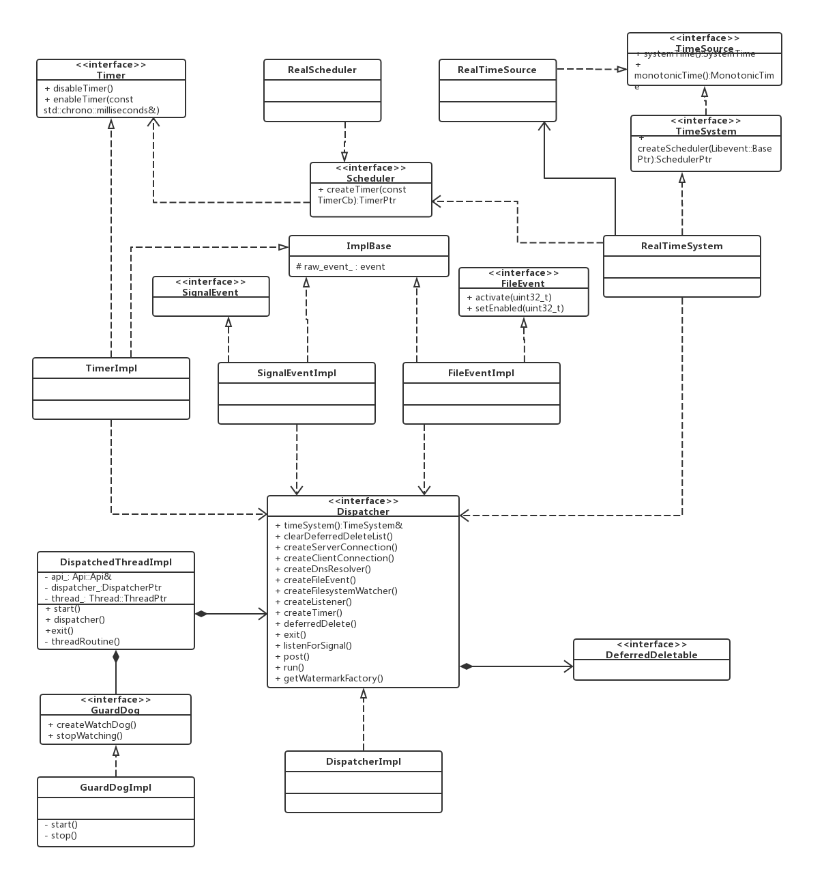

# Envoy 源码分析－－event

>申明：本文的 Envoy 源码分析基于 Envoy1.10.0。

Envoy 的事件是复用了 libevent 的 `event_base` 。其在代码中的表现就是类 `Dispatcher`，一个 `Dispatcher` 其实就是一个 `event_loop`，主要的核心功能有：网络事件处理，定时器，信号处理，任务队列，代码对象的析构等。下面是相关的类图。



`ImplBase` 包含了 libevent 的事件类型，对象在析构时会自动调用 `event_del`。 `ImplBase` 派生出 `FileEventImpl`、 `SignalEventImpl` 和 `TimerImpl` 三种类型的事件。 `RealTimeSystem` 在创建调度后，会创建一个线程局部存储（TLS）的时间队列。`DispatchedThreadImpl` 包含了 `DispatcherImpl` 在启动时会创建一条线程，然后启动一个 `event_loop`，同时在 `event_loop` 外层包了个 `guard_dog` 防止死锁。


## libevent

Envoy 是 C++ 的，而 libevent 是个 C 库，这就需要自动管理 C 结构的内存。 Envoy 通过继承智能指针 `unique_ptr` 来重新封装了 libevent 的结构体。

```
template <class T, void (*deleter)(T*)> class CSmartPtr : public std::unique_ptr<T, void (*)(T*)> {
public:
  CSmartPtr() : std::unique_ptr<T, void (*)(T*)>(nullptr, deleter) {}
  CSmartPtr(T* object) : std::unique_ptr<T, void (*)(T*)>(object, deleter) {}
};
```

然后使用 `CSmartPtr` 就可以自动管理 libevent 的结构体。使用方式如下：

```
struct event_base;
extern "C" {
void event_base_free(event_base*);
}

struct evbuffer;
extern "C" {
void evbuffer_free(evbuffer*);
}

struct bufferevent;
extern "C" {
void bufferevent_free(bufferevent*);
}

struct evconnlistener;
extern "C" {
void evconnlistener_free(evconnlistener*);
}

typedef CSmartPtr<event_base, event_base_free> BasePtr;
typedef CSmartPtr<evbuffer, evbuffer_free> BufferPtr;
typedef CSmartPtr<bufferevent, bufferevent_free> BufferEventPtr;
typedef CSmartPtr<evconnlistener, evconnlistener_free> ListenerPtr;
```
这样 libevent 的结构体就变成了 C++ 的智能指针。

Envoy 有三种事件都是 `event` 类型，我们需要对事件类型进行抽象，自动管理事件的释放。Envoy 将 `event` 作为 `ImplBase`的成员，在类析构进自动释放，所有事件只要继承 `ImplBase` 就完成了事件的自动管理。

```
class ImplBase {
protected:
  ~ImplBase();

  event raw_event_;
};

ImplBase::~ImplBase() {
  event_del(&raw_event_);
}
```

### Timer

Timer 只有两接口一个用于启动，另一个用于关闭。
```
class Timer {
public:
  virtual ~Timer() {}
  virtual void disableTimer() PURE;
  virtual void enableTimer(const std::chrono::milliseconds& d) PURE;
};
```
创建 Timer 时，会在构造函数内进行初始化。`enableTimer` 时调用 `event_add` 加入事件。 `disableTimer` 时调用 `event_del` 删除事件。
```
TimerImpl::TimerImpl(Libevent::BasePtr& libevent, TimerCb cb) : cb_(cb) {
  ASSERT(cb_);
  evtimer_assign(
      &raw_event_, libevent.get(),
      [](evutil_socket_t, short, void* arg) -> void { static_cast<TimerImpl*>(arg)->cb_(); }, this);
}

void TimerImpl::disableTimer() { event_del(&raw_event_); }

void TimerImpl::enableTimer(const std::chrono::milliseconds& d) {
  if (d.count() == 0) {
    event_active(&raw_event_, EV_TIMEOUT, 0);
  } else {
    // TODO(#4332): use duration_cast more nicely to clean up this code.
    std::chrono::microseconds us = std::chrono::duration_cast<std::chrono::microseconds>(d);
    timeval tv;
    tv.tv_sec = us.count() / 1000000;
    tv.tv_usec = us.count() % 1000000;
    event_add(&raw_event_, &tv);
  }
}
```

### SignalEvent

SignalEvent 比较简单在构造函数时，直接初始化并加入事件。
```
SignalEventImpl::SignalEventImpl(DispatcherImpl& dispatcher, int signal_num, SignalCb cb)
    : cb_(cb) {
  evsignal_assign(
      &raw_event_, &dispatcher.base(), signal_num,
      [](evutil_socket_t, short, void* arg) -> void { static_cast<SignalEventImpl*>(arg)->cb_(); },
      this);
  evsignal_add(&raw_event_, nullptr);
}
```

### FileEvent

文件相关的事件封装为 FileEvent。我们知道 linux 中 socket 也是一个文件，因此 socket 套接字相关的事件也属于 FileEvent。FileEvent 使用持久性事件假定用户一直读或写，直到收到 EAGAIN。

FileEvent 提供两个接口。`activate` 无论事件是否准备就绪，此方法都会主动触发事件，典型场景：socket 读写事件， EventLoop 唤醒等。`setEnabled` 用于设置事件。

```
class FileEvent {
public:
  virtual ~FileEvent() {}
  virtual void activate(uint32_t events) PURE;
  virtual void setEnabled(uint32_t events) PURE;
};
```


## RealTimeSystem

RealTimeSystem 暴露三个接口。

```
class RealTimeSystem : public TimeSystem {
public:
  SchedulerPtr createScheduler(Libevent::BasePtr&) override;
  SystemTime systemTime() override { return time_source_.systemTime(); }
  MonotonicTime monotonicTime() override { return time_source_.monotonicTime(); }

private:
  RealTimeSource time_source_;
}
```
 
 + `systemTime` 返回系统时间。调用的是 std::chrono 的 system_clock。
 + `monotonicTime` 返回的是系统的启动时间。即 linux 命令 `uptime` 上的启动时间。用于时间间隔，不会受系统修改时间的影响。调用的是 std::chrono 的 steady_clock。
 + `createScheduler` 创建一个计时器工厂（factory模式）。间接启用线程本地计时器队列管理，因此每个线程具有单独的计时器。 `RealScheduler` 类放在源文件中，外部无法调用。

```
//创建计时器工厂
SchedulerPtr RealTimeSystem::createScheduler(Libevent::BasePtr& libevent) {
  return std::make_unique<RealScheduler>(libevent);
}

class RealScheduler : public Scheduler {
public:
  RealScheduler(Libevent::BasePtr& libevent) : libevent_(libevent) {}
  //创建一个本地计时器
  TimerPtr createTimer(const TimerCb& cb) override {
    return std::make_unique<TimerImpl>(libevent_, cb);
  };

private:
  Libevent::BasePtr& libevent_;
};
```


## 任务队列

`Dispatcher` 内部创建了一个任务队列，将所有的 `callback` 加入队列。同时创建一个 `Timer` 调用一个函数，函数内循环处理。

`post` 方法将传进来的 `callback` 加入到任务任务。如果加入前的队列为空就需要触发定时器。`post_timer_` 在构造函数内已设置好其对应的函数，调用 `runPostCallbacks`。

```
void DispatcherImpl::post(std::function<void()> callback) {
  bool do_post;
  {
    Thread::LockGuard lock(post_lock_);
    do_post = post_callbacks_.empty();
    post_callbacks_.push_back(callback);
  }

  if (do_post) {
    post_timer_->enableTimer(std::chrono::milliseconds(0));
  }
}

DispatcherImpl::DispatcherImpl(TimeSystem& time_system, Buffer::WatermarkFactoryPtr&& factory,
                               Api::Api& api)
    : ...
      post_timer_(createTimer([this]() -> void { runPostCallbacks(); })),
      current_to_delete_(&to_delete_1_) {
  RELEASE_ASSERT(Libevent::Global::initialized(), "");
}
```

`runPostCallbacks` 是一个死循环，每次取一个 `callback` 进行处理。直到队列为空跳出循环。从这可以看出 `post` 进来的任务，如果在加入前队列为空的话，`runPostCallbacks` 已退出，因此需要重新触发 `post_timer_`。

```
void DispatcherImpl::runPostCallbacks() {
  while (true) {
    std::function<void()> callback;
    {
      Thread::LockGuard lock(post_lock_);
      if (post_callbacks_.empty()) {
        return;
      }
      callback = post_callbacks_.front();
      post_callbacks_.pop_front();
    }
    callback();
  }
}
```

## 延迟析构

延迟析构指的是将 `unique_ptr` 的对象的析构的动作交由 `Dispatcher` 来完成。 `DeferredDeletable` 是个空接口，所有析构的对象都要继承 `DeferredDeletable`。

```
class DeferredDeletable {
public:
  virtual ~DeferredDeletable() {}
};

typedef std::unique_ptr<DeferredDeletable> DeferredDeletablePtr;
```

`Dispatcher` 对象保存了所有要延迟析构的对象

```
  std::vector<DeferredDeletablePtr> to_delete_1_;
  std::vector<DeferredDeletablePtr> to_delete_2_;
  std::vector<DeferredDeletablePtr>* current_to_delete_;
```

`to_delete_1_` 和 `to_delete_2` 保存了析构的对象，`current_to_delete_` 指针当前要析构的对象。加入延迟析构对象时，如果当前的析构对象长度为 1，`deferred_delete_timer_` 就会被触发。

```
void DispatcherImpl::deferredDelete(DeferredDeletablePtr&& to_delete) {
  ASSERT(isThreadSafe());
  current_to_delete_->emplace_back(std::move(to_delete));
  ENVOY_LOG(trace, "item added to deferred deletion list (size={})", current_to_delete_->size());
  if (1 == current_to_delete_->size()) {
    deferred_delete_timer_->enableTimer(std::chrono::milliseconds(0));
  }
}
```

`deferred_delete_timer_` 是在构造函数内已构造好回调函数 `clearDeferredDeleteList`。`clearDeferredDeleteList` 中 `current_to_delete_`始终指向当前正要析构的对象列表，每次执行完析构后就指向另外一个对象列表，来回交替。

```
void DispatcherImpl::clearDeferredDeleteList() {
  ASSERT(isThreadSafe());
  std::vector<DeferredDeletablePtr>* to_delete = current_to_delete_;

  size_t num_to_delete = to_delete->size();
  if (deferred_deleting_ || !num_to_delete) {
    return;
  }

  ENVOY_LOG(trace, "clearing deferred deletion list (size={})", num_to_delete);

  if (current_to_delete_ == &to_delete_1_) {
    current_to_delete_ = &to_delete_2_;
  } else {
    current_to_delete_ = &to_delete_1_;
  }

  deferred_deleting_ = true;

  for (size_t i = 0; i < num_to_delete; i++) {
    (*to_delete)[i].reset();
  }

  to_delete->clear();
  deferred_deleting_ = false;
}
```

可以看出延迟析构的原理和任务队列原理差不多。

为何要延迟析构以及析构时为何需要两个队列，可参考：[https://yq.aliyun.com/articles/659277](https://yq.aliyun.com/articles/659277)


## dispacth_thread

`dispacth_thread` 只是一个简单的 `event_loop` 线程，不支持像接收新连接那样的工作线程。 接口很简单，在启动时，启动一个新线程，在新线程中调用 `dispatch` run 执行 `event_loop`。同时会新建一个 `GuardDog` 监控线程是否死锁。

```
void DispatchedThreadImpl::start(Server::GuardDog& guard_dog) {
  thread_ =
      api_.threadFactory().createThread([this, &guard_dog]() -> void { threadRoutine(guard_dog); });
}

void DispatchedThreadImpl::threadRoutine(Server::GuardDog& guard_dog) {
  ENVOY_LOG(debug, "dispatched thread entering dispatch loop");
  auto watchdog = guard_dog.createWatchDog(api_.threadFactory().currentThreadId());
  watchdog->startWatchdog(*dispatcher_);
  dispatcher_->run(Dispatcher::RunType::Block);
  ENVOY_LOG(debug, "dispatched thread exited dispatch loop");
  guard_dog.stopWatching(watchdog);

  watchdog.reset();
  dispatcher_.reset();
}
```

----

参考文档: [https://yq.aliyun.com/articles/659277](https://yq.aliyun.com/articles/659277)
