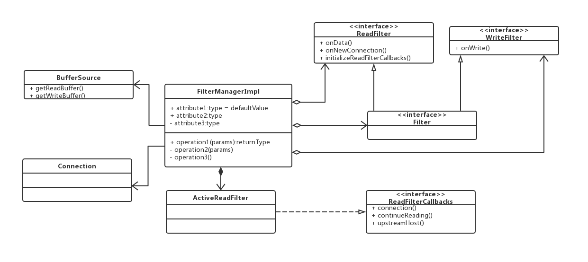

# Envoy 源码分析－－network L4 filter manager

>申明：本文的 Envoy 源码分析基于 Envoy1.10.0。

承接[Envoy 源码分析－－network](./envoy_network.md)，上次 network 只分析到 L4 过滤，这次接下来分析。

L4 过滤有三个不同类型的过滤器：

+ 读过滤：当 Envoy 从下游连接接收数据时，调用读过滤器。
+ 写过滤：当 Envoy 要发送数据到下游连接时，调用写过滤器。
+ 读/写过滤：当 Envoy 从下游连接接收数据和要发送数据到下游连接时，调用读/写过滤器。

网络级过滤器的 API 相对简单，因为最终过滤器只操作原始字节和少量连接事件（例如，TLS 握手完成、连接在本地或远程断开等）。

现在我们来分析下 L4 过滤的过滤管理，先看 UML 类图。

 

